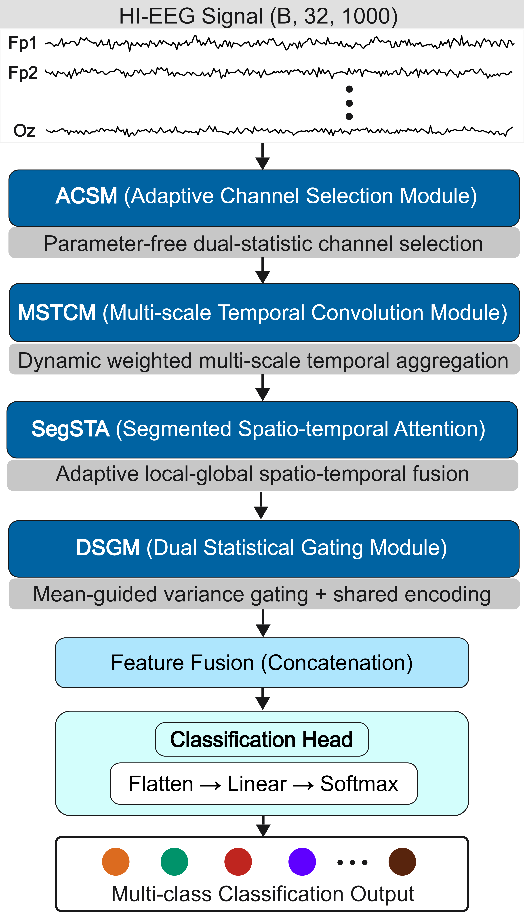

# FineSTAN
## Fine-grained Spatio-Temporal Attention Network for EEG-based Handwriting Imagery Decoding
This repository contains the official PyTorch implementation of FineSTAN for handwriting imagery EEG decoding.

## Network Architecture


FineSTAN is a lightweight spatio-temporal attention network composed of four core collaborative modules: adaptive channel selection module (ACSM), multi-scale temporal convolution module (MSTCM), segmented spatio-temporal attention (SegSTA), and dual statistic gate module (DSGM). The whole framework is tailored to extract discriminative spatio-temporal features and improve cross-session decoding performance of handwriting imagery EEG signals.

## Requirements
* Python ≥ 3.9
* PyTorch ≥ 2.1.0
* mne == 1.11.0
* numpy
* einops
* pyyaml
* matplotlib

## Datasets
Three self-established cross-lingual handwriting imagery EEG datasets are adopted for model validation in this work:
1. **CCS-HI & SV-HI** (Chinese strokes and Pinyin single vowels)
These two datasets are formally documented in our published journal paper:
> Wang F, Chen Y, Wang P, et al. An EEG dataset for handwriting imagery decoding of Chinese character strokes and Pinyin single vowels[J]. Scientific Data, 2026.
Raw EEG recordings are available at https://doi.org/10.6084/m9.figshare.29987758.v4. Please cite the corresponding journal article when you use CCS-HI and SV-HI.

2. **ELL-HI** (English lowercase letter handwriting imagery)
This newly released dataset is hosted on Figshare, accessible at https://doi.org/10.6084/m9.figshare.32676945.v1.

## Results
Comprehensive experimental metrics, ablation studies and neural activation visualization analysis are elaborated in our submitted manuscript.

## Citation
If you utilize this code framework or the ELL-HI dataset in your research, please cite our submitted manuscript first:
```bibtex
@article{2026finestan,
  title={FineSTAN: A Fine-grained Spatio-Temporal Attention Network for EEG-based Handwriting Imagery Decoding},
  author={Fan Wang},
  journal={Under Review},
  year={2026}
}
